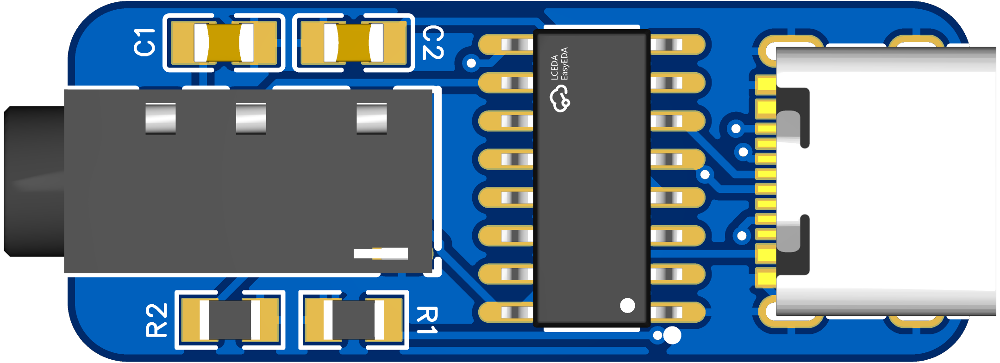
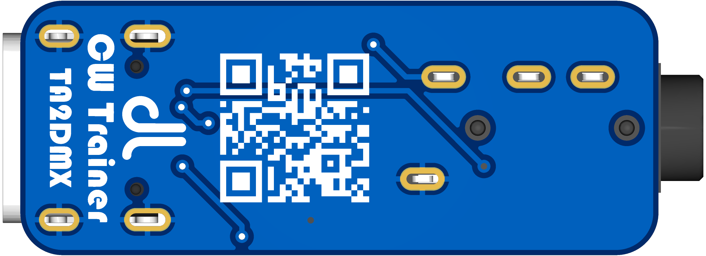
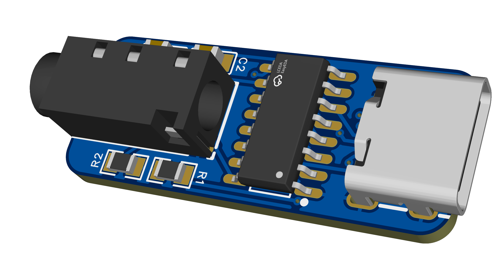
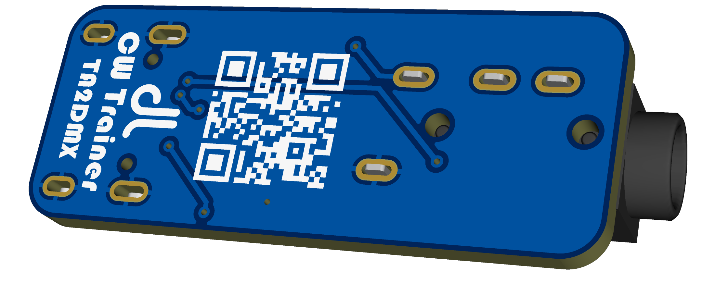
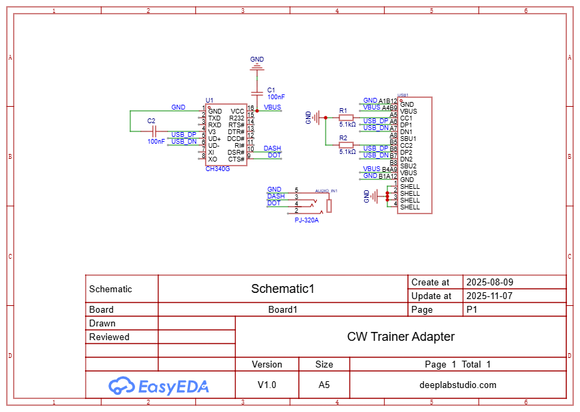

# CW-Trainer-Adapter
A compact USB interface that allows you to use **Morse keys (straight or iambic)** with your computer or mobile device.  
Based on the **CH340 USB-to-Serial converter**, it utilizes the **DSR** and **CTS** pins to read key input directly from a **3.5mm CW jack** — perfect for use with **CW Trainer** or **Morse practice software**.

## PCB

  
  
  
  

---
### Schematic

---
## ⚙️ Features
- **USB to Serial Interface:** CH340 IC  
- **CW Key Input:** 3.5mm stereo jack (supports straight or iambic keys)  
- **Signal Pins:** Uses **DSR** and **CTS** for paddle/key detection  
- **Compatibility:**  
  - Works with PC **CW Trainer** and **Morse Practice** programs  
  - Supports **mobile devices** with **USB-OTG**  
- **Plug & Play:** No external power needed  
- **Compact Design:** Lightweight and portable  
- **Optional LED indicators** for signal activity

---
## 💡 Use Case
Easily practice CW on your computer or phone!  
Just plug your key into the 3.5mm jack, connect the adapter via USB or OTG, and start your favorite CW Trainer app.  
Perfect for **ham radio operators**, **learners**, and **Morse enthusiasts**.

---
## Donate

